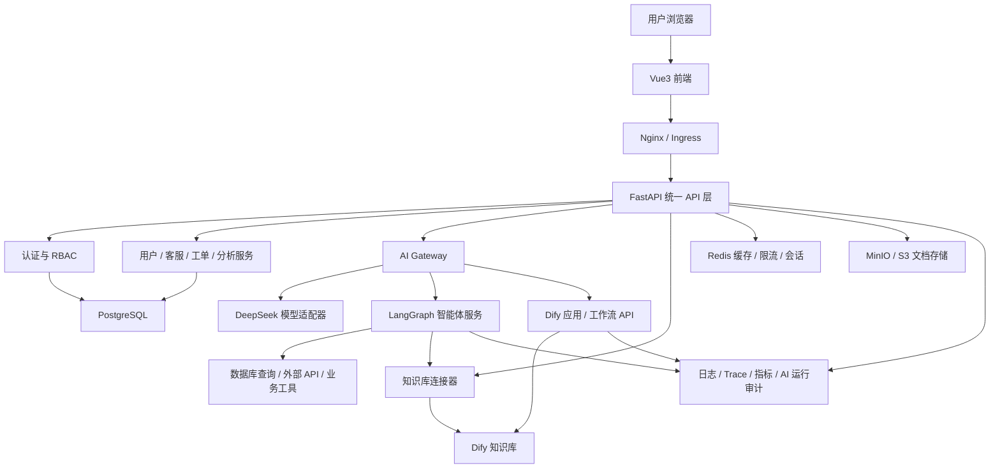

# 东软智慧商务 AI 助手平台技术方案指导文档（V0.2 讨论稿）

> 文档定位：用于统一教学项目的技术边界、系统架构、模块职责、接口规范、实施范围和验收标准。  
> 当前状态：讨论稿，重点解决 Vue3、FastAPI、DeepSeek、LangGraph、Dify 的协作关系。

## 1. 项目目标

建设面向企业用户、客服人员、系统管理员和决策者的智慧商务 AI 助手平台，实现：

1. AI 智能对话：多轮对话、意图识别、工具调用、上下文记忆和流式输出。
2. 企业知识库问答：文档上传、切分索引、检索增强、答案引用与反馈。
3. 智能客服辅助：问题分类、推荐回复、人工确认、对话记录管理。
4. 语音能力：文字转语音作为核心交付，语音识别作为增强功能。
5. 智能分析：咨询量、问题分类、满意度和高频问题洞察。
6. AI 服务编排：通过 FastAPI 统一封装 DeepSeek、LangGraph 和 Dify。

## 2. 技术方案核心原则

### 2.1 统一入口

浏览器只能访问 Vue3 前端和 FastAPI API，不直接调用 DeepSeek、LangGraph 或 Dify。模型密钥、Dify API Key、提示词和内部工作流不得暴露到前端。

### 2.2 单一编排责任

- FastAPI：系统级编排、鉴权、权限、数据持久化、路由、限流、审计和统一异常处理。
- LangGraph：需要代码控制、状态管理、工具调用和多步骤决策的智能体流程。
- Dify：知识库管理、可视化低代码工作流、运营人员可配置的 AI 应用和语音能力。
- DeepSeek：底层大模型能力，通过统一模型适配器访问。

同一条业务流程只能有一个主要 AI 编排引擎，禁止 LangGraph 与 Dify 相互循环调用。

### 2.3 教学实现与集成交付分层

- 教学实验阶段：可以分别实现 LangChain + FAISS/Chroma RAG、LangGraph Agent、Dify 知识库与工作流。
- 最终集成阶段：必须确定一个正式知识库来源和一个主要编排入口，避免重复索引、重复切分和答案不一致。

### 2.4 先完成可验收闭环

优先完成“登录 -> 对话 -> AI 路由 -> 工具/知识检索 -> 流式回复 -> 记录落库 -> 用户反馈”的完整闭环，再扩展多 Agent、语音识别、文生图和 Kubernetes。

## 3. 总体架构



## 4. 各技术组件职责

| 组件 | 主要职责 | 不应承担的职责 |
|---|---|---|
| Vue3 | 页面交互、角色工作台、对话流展示、文件上传、数据可视化 | 保存模型密钥、直接调用模型、决定核心 AI 路由 |
| FastAPI | API 契约、鉴权、RBAC、业务服务、AI 路由、流式输出、审计、数据持久化 | 在路由函数中堆积提示词和复杂 Agent 逻辑 |
| DeepSeek | 对话生成、结构化输出、工具调用所需的模型推理 | 直接访问业务数据库或暴露给浏览器 |
| LangGraph | 状态化 Agent、条件路由、工具调用、多步骤任务、人工确认节点 | 用户管理、文件管理、通用 CRUD、前端会话鉴权 |
| Dify | 知识库、可视化工作流、可运营配置的应用、TTS 等低代码能力 | 作为系统唯一用户中心或直接暴露所有管理权限 |
| PostgreSQL | 用户、角色、对话、消息、工单、反馈、AI 运行记录和配置版本 | 存储大文件正文或作为短期流式消息队列 |
| Redis | 缓存、限流、短期会话、任务状态、幂等键 | 长期业务数据的唯一存储 |
| MinIO/S3 | 上传文档、语音和生成文件的对象存储 | 结构化业务查询 |

## 5. 推荐 AI 路由策略

### 5.1 普通 AI 对话

`Vue3 -> FastAPI -> AI Gateway -> DeepSeek -> SSE -> Vue3`

适用于不需要工具和知识库的普通问答。

### 5.2 工具调用与业务查询

`Vue3 -> FastAPI -> LangGraph -> 业务工具 -> DeepSeek 组织答案 -> SSE`

适用于订单查询、客户信息查询、数据统计等必须访问受控业务工具的场景。

### 5.3 企业知识库问答

推荐最终交付以 Dify 知识库为正式知识源：

`Vue3 -> FastAPI -> 知识库连接器 -> Dify 检索/应用 -> 带引用答案`

LangGraph 如需使用企业知识，应调用统一的知识库连接器，不自行维护第二份正式索引。

### 5.4 智能客服辅助

`客户问题 -> LangGraph 分类 -> 知识检索/业务查询 -> 生成建议回复 -> 质检 -> 客服人工确认 -> 发送`

客服回复默认采用 Human-in-the-loop，不建议在教学项目中直接全自动发送。

### 5.5 Dify 工作流

适合以下场景：

- 知识库维护和检索测试；
- 运营人员可调整的提示词或工作流；
- TTS、摘要、报告生成等低风险能力；
- 快速验证新 AI 场景。

不建议用 Dify 重复实现已经由 LangGraph 管理的核心多 Agent 业务流程。

## 6. 前端模块

### 6.1 企业用户端

- 登录与个人中心；
- AI 对话；
- 知识库问答；
- 答案引用、复制、赞踩反馈；
- TTS 播放；
- 历史会话。

### 6.2 客服人员端

- 待处理咨询列表；
- 客户对话窗口；
- AI 问题分类；
- 推荐回复与人工编辑确认；
- FAQ 维护；
- 历史记录检索。

### 6.3 管理员端

- 用户与角色管理；
- 文档上传和知识库同步；
- 模型、提示词和工作流配置；
- AI 运行记录与失败记录；
- 评价数据与基础统计。

### 6.4 决策者端

- 咨询量趋势；
- 问题分类分布；
- 满意度与人工接管率；
- 高频问题和 AI 摘要卡片。

## 7. FastAPI 后端模块

建议按领域拆分：

```text
app/
  api/              # REST/SSE 路由
  core/             # 配置、安全、异常、日志
  auth/             # 登录、JWT、RBAC
  users/            # 用户与角色
  conversations/    # 会话与消息
  customer_service/ # 客服与工单
  knowledge/        # 文档与知识库连接器
  ai/
    gateway/        # 统一调用入口
    providers/      # DeepSeek 等模型适配器
    graphs/         # LangGraph 流程
    dify/           # Dify API 适配器
    prompts/        # 提示词模板与版本
    schemas/        # AI 统一请求/响应事件
  analytics/        # 指标与报表
  audit/            # AI Run、工具调用、审计日志
  db/               # SQLAlchemy 与迁移
```

原则：API 路由只负责参数校验和调用应用服务，不直接编写复杂提示词、数据库 SQL 或 Agent 图。

## 8. 核心数据模型

建议至少包含：

- `users`、`roles`、`user_roles`
- `conversations`、`messages`
- `ai_runs`、`ai_run_events`、`tool_calls`
- `knowledge_documents`、`knowledge_sync_jobs`
- `customer_tickets`、`reply_suggestions`
- `feedback`
- `model_configs`、`prompt_templates`、`prompt_versions`
- `audit_logs`

所有 AI 请求应记录 `request_id`、`conversation_id`、`run_id`、模型、耗时、Token 用量、调用路径、错误码和用户反馈。

## 9. API 与流式事件规范

建议统一使用 `/api/v1` 前缀：

- `/auth/*`
- `/users/*`
- `/conversations/*`
- `/ai/chat/stream`
- `/ai/agent/stream`
- `/knowledge/documents/*`
- `/knowledge/query`
- `/customer-service/*`
- `/analytics/*`
- `/admin/ai-config/*`

大模型输出优先使用 SSE。统一事件类型：

- `metadata`
- `token`
- `tool_call`
- `tool_result`
- `citation`
- `message_end`
- `error`

前端不依赖 DeepSeek、LangGraph 或 Dify 的原始响应格式，只依赖平台统一事件协议。

## 10. 安全与可靠性

1. 模型和 Dify 密钥只保存在服务端环境变量或密钥管理系统。
2. 实施 JWT/OAuth2、RBAC 和接口权限校验。
3. 上传文件限制格式、大小和数量，并进行恶意文件检查。
4. 工具调用采用白名单和 Pydantic 参数校验，禁止模型直接执行任意 SQL 或系统命令。
5. 对模型调用设置超时、重试、并发限制、熔断和降级回复。
6. 对提示词注入、越权检索、敏感信息泄露进行专项测试。
7. 对管理员修改模型配置、提示词和知识库的行为记录审计日志。
8. 对答案展示引用来源；无法确认时明确表达不确定性。

## 11. 测试与 AI 评估

### 11.1 常规测试

- 后端单元测试与 API 集成测试；
- 前端组件测试和关键流程 E2E 测试；
- 权限、异常、超时和并发测试；
- Docker Compose 启动与健康检查。

### 11.2 AI 专项评估

“AI 功能准确率不低于 80%”必须转化为可重复执行的测试集，建议建立至少 100 条标注样例，分别评估：

- 意图分类准确率；
- 工具选择准确率；
- 工具参数正确率；
- 知识检索命中率；
- 答案正确性与引用一致性；
- 客服回复可用率；
- 拒答和安全边界表现。

## 12. 分阶段实施范围

### 12.1 核心交付范围

1. Vue3 登录、角色工作台和基础管理页面；
2. FastAPI 鉴权、RBAC、会话和消息接口；
3. DeepSeek 流式对话；
4. LangGraph 单 Agent + 至少一个业务工具；
5. 企业知识库问答并展示引用；
6. 客服推荐回复和人工确认；
7. Dify TTS；
8. AI 运行日志、反馈和基础统计；
9. Docker Compose 一键启动。

### 12.2 增强范围

- 多 Agent 分类、查询、回复和质检；
- 语音识别输入；
- 文生图；
- 复杂智能分析报告；
- 模型自动降级；
- Kubernetes、Ingress 和完整 CI/CD。

## 13. 推荐部署拓扑

教学和验收环境优先使用 Docker Compose：

- `frontend`
- `backend`
- `postgres`
- `redis`
- `minio`（可选）
- `dify` 独立服务组

Kubernetes 作为增强教学内容，不作为核心功能完成的前置条件。Dify 依赖较多，建议与业务应用分开维护 Compose 配置，避免初学者一次性调试全部容器。

## 14. 当前需要统一的方案决策

建议采用以下默认结论：

1. **系统形态**：教学演示级、单企业租户，数据模型预留 `tenant_id`。
2. **主要 Agent 编排**：LangGraph。
3. **正式知识库**：Dify 知识库；FAISS/Chroma 用于课程实验，不作为最终双轨生产知识库。
4. **统一入口**：所有 AI 能力必须经过 FastAPI。
5. **模型策略**：DeepSeek 为主模型，通过 Provider Adapter 保留切换通义千问/OpenAI 兼容模型的能力。
6. **流式协议**：SSE；只有真正的双向实时客服场景才使用 WebSocket。
7. **核心部署验收**：Docker Compose；Kubernetes 为增强项。
8. **人工控制**：客服建议回复必须人工确认，敏感工具调用必须具备权限检查和审计。

## 15. 后续文档完善项

V0.2 建议继续补充：

1. 用例图和角色权限矩阵；
2. 核心业务时序图；
3. 数据库 ER 图；
4. API 请求/响应示例；
5. LangGraph State、节点和条件边定义；
6. Dify 应用清单及 API 对接规范；
7. 部署资源估算和环境变量清单；
8. 测试数据集、AI 评估表和验收 Checklist；
9. 12 天实施任务拆分和团队分工模板。


## 16. Python 依赖库与教学重点

### 16.1 原始清单规范化

原始资料中的 `sqlal chemy`、`pydantie` 和 `pumpy` 是拼写错误，正确包名分别为 `sqlalchemy`、`pydantic` 和 `numpy`。FastAPI 路由装饰器应写成 `@app.get("/")`，Uvicorn 热重载参数应写成 `--reload`。

| pip 安装包名 | Python 导入名 | 用途 | 教学重点 |
|---|---|---|---|
| `fastapi` | `fastapi` | Web API 框架 | `FastAPI()`、`@app.get()`/`@app.post()`、依赖注入、异常处理、自动 API 文档、流式响应 |
| `uvicorn[standard]` | `uvicorn` | ASGI 服务器，运行 FastAPI | `uvicorn app.main:app --reload`、host/port、开发热重载与生产运行的区别 |
| `sqlalchemy` | `sqlalchemy` | 数据库 Core 与 ORM | Declarative Model、`Mapped`、`mapped_column()`、Session、关系映射、事务；ORM 不能替代 SQL 基础 |
| `pydantic` | `pydantic` | 请求、响应和配置数据校验 | `BaseModel`、类型标注、`Field`、Validator、嵌套模型、`model_dump()`、校验错误 |
| `dashscope` | `dashscope` | 阿里云百炼 SDK | API Key 环境变量、通义千问调用、流式输出、Embedding、异常和限流处理 |
| `numpy` | `numpy` | 数值与向量计算 | ndarray、向量归一化、点积、余弦相似度；只有归一化后点积才等价于余弦相似度 |
| `python-multipart` | 通常不直接导入 | FastAPI 表单和文件上传解析 | `multipart/form-data`、`UploadFile`、文件大小/类型校验、临时文件处理 |
| `pypdf` | `pypdf` | PDF 文本解析 | `PdfReader`、逐页提取文本、页码元数据；扫描版 PDF 需要 OCR，不能仅依赖 pypdf |
| `python-docx` | `docx` | `.docx` Word 文档解析 | `Document`、段落、表格、标题层级；不负责旧版 `.doc` 文件解析 |

### 16.2 当前架构必须补充的依赖

原始清单可以支撑 FastAPI、数据库、百炼调用和基础文档解析，但无法完整实现需求中的 DeepSeek、LangGraph、Dify、缓存、数据库迁移和测试。

| pip 安装包名 | 用途 | 教学重点 | 是否核心 |
|---|---|---|---|
| `langchain` | 模型、Prompt、Tool、文档和检索抽象 | Model、Prompt、Tool、Runnable、结构化输出 | 核心 |
| `langgraph` | 状态化智能体和工作流编排 | State、Node、Edge、条件路由、Checkpoint、Human-in-the-loop | 核心 |
| `langchain-deepseek` | LangChain 的 DeepSeek 模型适配 | 模型初始化、流式输出、工具调用、Provider 解耦 | 核心 |
| `langchain-community` | 社区文档加载器和部分向量库集成 | Loader 的适用范围、第三方依赖边界 | 课程需要 |
| `faiss-cpu` 或 `chromadb` | RAG 实验向量存储 | 二选一完成课程实验，避免学生同时维护两套实验代码 | 课程需要 |
| `httpx` | 异步 HTTP 客户端 | 调用 Dify 和其他服务、连接池、超时、重试、流式响应 | 核心 |
| `redis` | Redis Python 客户端 | 缓存、限流、幂等、短期状态；不得作为长期业务数据唯一存储 | 核心 |
| `alembic` | SQLAlchemy 数据库迁移 | revision、upgrade、downgrade、版本化数据库结构 | 核心 |
| `psycopg[binary]` | PostgreSQL 驱动 | 数据库连接、连接池、事务；开发环境可使用 binary 发行包 | PostgreSQL 时核心 |
| `pydantic-settings` | 环境变量和配置管理 | `.env`、配置分环境、密钥不入库 | 核心 |
| `PyJWT[crypto]` | JWT 生成与验证 | access token、过期时间、签名验证、权限声明 | 核心 |
| `pwdlib[argon2]` | 密码哈希 | 不保存明文密码、哈希验证、算法配置 | 核心 |
| `sse-starlette` | SSE 响应辅助 | 事件类型、断线、心跳、结束事件；也可直接使用 FastAPI StreamingResponse | 推荐 |
| `pytest` | Python 测试框架 | 单元测试、Fixture、异常场景、AI Provider Mock | 核心 |
| `pytest-asyncio` | 异步代码测试 | FastAPI、HTTPX、异步模型调用测试 | 核心 |

### 16.3 Dify 对接方式

Dify 应优先通过 HTTP API 接入，因此不要求安装所谓“Dify Python SDK”。后端统一使用 `httpx.AsyncClient` 封装：

```text
app/ai/dify/client.py
app/ai/dify/schemas.py
app/ai/dify/exceptions.py
```

Dify API Key 必须保存在后端环境变量中，浏览器不能直接访问 Dify API。

### 16.4 推荐分组安装

为了降低首日环境搭建失败率，建议不要一次安装所有 AI 依赖，而是按教学阶段分组：

```bash
# 第一阶段：FastAPI 基础
pip install fastapi "uvicorn[standard]" sqlalchemy pydantic pydantic-settings python-multipart

# 第二阶段：数据库与安全
pip install alembic "psycopg[binary]" redis "PyJWT[crypto]" "pwdlib[argon2]"

# 第三阶段：大模型与智能体
pip install dashscope langchain langgraph langchain-deepseek langchain-community httpx

# 第四阶段：RAG 文档处理
pip install numpy pypdf python-docx faiss-cpu

# 第五阶段：测试
pip install pytest pytest-asyncio
```

如果课堂统一选择 Chroma，则将 `faiss-cpu` 替换为 `chromadb`。最终项目不应同时强制安装和使用 FAISS、Chroma、Dify 三套正式向量存储。

### 16.5 最小代码示例应采用的正确写法

```python
from fastapi import FastAPI

app = FastAPI()


@app.get("/")
async def health_check() -> dict[str, str]:
    return {"status": "ok"}
```

开发环境启动：

```bash
uvicorn app.main:app --reload
```

`--reload` 只用于本地开发；容器或生产环境不使用热重载，并应根据部署资源配置进程和并发策略。
